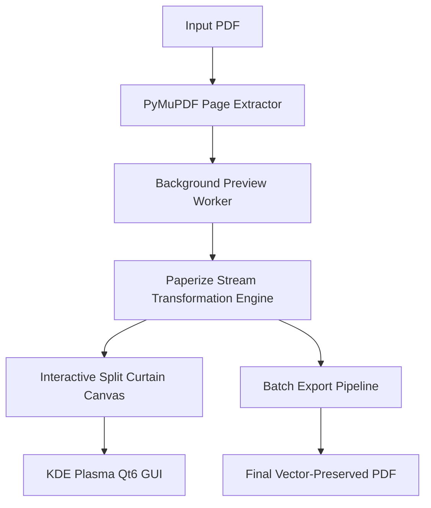

# Paperizer 📜✨

> **A quiet, native PDF reader & warm paper styler for Linux.**  
> Inspired by the distraction-free philosophy of [Humanitas Labs' Paper](https://github.com/humanitas-labs/paper) and built on [Paperize](https://github.com/humanitas-labs/paperize).


---

## Design Philosophy: Radical Minimalism

Most PDF readers are covered in bulky toolbars, side panels, and menus that invite you to do everything other than read.

**Paperizer puts the document first.**
- **Full-Bleed Quiet Canvas**: Nothing between you and the reading material.
- **Default to Warm Paper**: Opens directly in peaceful, eye-friendly paper mode.
- **Auto-Fading Capsule**: A subtle glass pill dock floats quietly at the bottom and gently hides after 3 seconds of reading.
- **Non-Destructive Vector Warmth**: Text, vector graphics, and links are never rasterized or degraded. White glare becomes soft paper.
- 🎨 **Aesthetic Reading Presets**:
  - **Parchment**: Soft golden-warm antique paper with subtle radial falloff.
  - **Cream**: Gentle off-white/ivory ideal for prolonged night reading.
  - **Sepia**: Classic library vintage aesthetic.
- 🛠️ **Real-Time Fine-Tuning**: Sliders for Warmth/Strength, Paper Texture grain, and Vignette falloff.
- ⚡ **Zero-Freeze Multithreading**: Background rendering workers (`QThread`) ensure the UI stays responsive even when rendering high-DPI document previews.
- 📂 **Batch Processing**: Queue entire directories of books, whitepapers, or planners and convert them with one click.
- 🐧 **Native KDE Plasma & Linux Integration**: Automatically follows system color palettes (Breeze Light / Dark) and runs natively on Wayland and X11.

---

## Architecture & Technology Stack



- **Frontend**: PySide6 (Qt 6.11+)
- **Rendering & Preview**: PyMuPDF (`fitz`)
- **PDF Manipulation Engine**: `pikepdf` + `paperize-pdf`
- **Target OS**: Linux (CachyOS / Arch Linux / KDE Plasma / Wayland)

---

## Installation & Setup

### 1. Arch Linux / CachyOS (via AUR / PKGBUILD)

```bash
git clone https://github.com/kai/paperize-gui.git
cd paperize-gui
makepkg -si
```

### 2. Manual / Developer Installation

```bash
# Clone the repository
git clone https://github.com/kai/paperize-gui.git
cd paperize-gui

# Create a virtual environment
python3 -m venv .venv
source .venv/bin/activate

# Install dependencies and package
pip install -e .

# Run the app
paperize-gui
```

---

## Usage

```bash
# Launch GUI directly
paperize-gui

# Open a specific PDF immediately on launch
paperize-gui path/to/document.pdf
```

### Keyboard Shortcuts
- `Ctrl + O`: Open PDF
- `Ctrl + S`: Export current document
- `Ctrl + +` / `Ctrl + -`: Zoom in / Zoom out
- `PageUp` / `PageDown`: Previous / Next page
- `Ctrl + Wheel`: Zoom canvas

---

## License

MIT License. Core PDF stream algorithm courtesy of [Humanitas Labs / Paperize](https://github.com/humanitas-labs/paperize).
