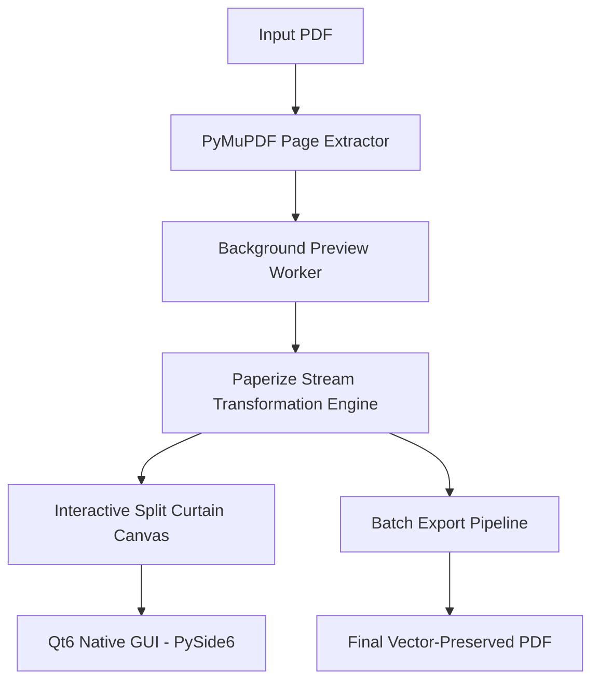

# Paperizer 📜✨

> **A quiet, native PDF reader & warm paper styler for Linux & Windows.**  
> Inspired by the distraction-free philosophy of [Humanitas Labs' Paper](https://github.com/humanitas-labs/paper) and built on [Paperize](https://github.com/humanitas-labs/paperize).

[](https://github.com/Refayatul/paperizer/releases/latest)
[](LICENSE)
[](#installation)
[](https://www.python.org/)
[](https://www.qt.io/)

<p align="center">
  
</p>

---

## Quick Downloads (v0.1.1)

| Platform | Format | Package | Install Command / Action |
| :--- | :--- | :--- | :--- |
| **Windows 10 / 11** | Setup Installer | [**`Paperizer-0.1.1-Setup-x64.exe`**](https://github.com/Refayatul/paperizer/releases/download/v0.1.1/Paperizer-0.1.1-Setup-x64.exe) | Double-click to install (Desktop & Start Menu shortcuts, Explorer integration) |
| **Windows 10 / 11** | Portable ZIP | [**`Paperizer-0.1.1-Windows-Portable.zip`**](https://github.com/Refayatul/paperizer/releases/download/v0.1.1/Paperizer-0.1.1-Windows-Portable.zip) | Extract and double-click `Paperizer.exe` (No admin/install needed) |
| **Arch / CachyOS** | Native Package | [**`paperizer-0.1.1-1-any.pkg.tar.zst`**](https://github.com/Refayatul/paperizer/releases/download/v0.1.1/paperizer-0.1.1-1-any.pkg.tar.zst) | `sudo pacman -U <url>` |
| **Debian / Ubuntu** | `.deb` | [**`paperizer_0.1.1-1_all.deb`**](https://github.com/Refayatul/paperizer/releases/download/v0.1.1/paperizer_0.1.1-1_all.deb) | `sudo apt install ./paperizer_0.1.1-1_all.deb` |
| **Fedora / RHEL** | `.rpm` | [**`paperizer-0.1.1-1.noarch.rpm`**](https://github.com/Refayatul/paperizer/releases/download/v0.1.1/paperizer-0.1.1-1.noarch.rpm) | `sudo dnf install <url>` |
| **Any OS (Python)** | Wheel | [**`paperizer-0.1.1-py3-none-any.whl`**](https://github.com/Refayatul/paperizer/releases/download/v0.1.1/paperizer-0.1.1-py3-none-any.whl) | `pip install <url>` |

---

## Design Philosophy: Radical Minimalism

Most PDF readers are covered in bulky toolbars, side panels, and menus that invite you to do everything other than read.

**Paperizer puts the document first.**
- **Full-Bleed Quiet Canvas**: Nothing between you and the reading material.
- **Default to Warm Paper**: Opens directly in peaceful, eye-friendly paper mode.
- **Auto-Fading Capsule**: A subtle glass pill dock floats quietly at the bottom and gently hides after 3.2 seconds of reading.
- **Non-Destructive Vector Warmth**: Text, vector graphics, and links are never rasterized or degraded. Harsh white glare is transformed into soft organic paper.
- 🎨 **Aesthetic Reading Presets**:
  - **Parchment**: Soft golden-warm antique paper with subtle radial falloff.
  - **Cream**: Gentle off-white/ivory ideal for prolonged night reading.
  - **Sepia**: Classic library vintage aesthetic.
- 🛠️ **Real-Time Fine-Tuning**: Sliders for Warmth/Strength, Paper Texture grain, and Vignette falloff.
- ⚡ **Zero-Freeze Multithreading**: Background rendering workers (`QThread`) ensure the UI stays responsive even when rendering high-DPI document previews.
- 📂 **Batch Processing**: Queue entire directories of books, whitepapers, or planners and convert them with one click.
- 🐧 **Linux & Windows Native Integration**:
  - **Linux**: Wayland and X11 native, adheres to KDE Plasma and GNOME system color schemes (Breeze Light / Dark).
  - **Windows**: Native Windows 10/11 taskbar grouping (`AppUserModelID`), high-DPI scaling, and Windows Explorer right-click *"Open with Paperizer"* integration.

---

## Architecture & Technology Stack



- **Frontend**: PySide6 (Qt 6.6+)
- **Retina Preview Engine**: PyMuPDF (`fitz`) with supersampled rendering
- **PDF Manipulation Engine**: `pikepdf` + `paperize-pdf`
- **Supported Platforms**:
  - **Linux**: CachyOS, Arch Linux, Ubuntu, Debian, Fedora, openSUSE (Wayland & X11)
  - **Windows**: Windows 10 & Windows 11 (64-bit)

---

## Installation Guide

### 1. Windows 10 & 11

- **Setup Installer (`.exe`)**:
  Download [**`Paperizer-0.1.1-Setup-x64.exe`**](https://github.com/Refayatul/paperizer/releases/download/v0.1.1/Paperizer-0.1.1-Setup-x64.exe) and run the wizard. It adds Desktop & Start Menu shortcuts, a clean uninstaller in Windows Settings, and right-click *"Open with Paperizer"* for `.pdf` files.
- **Portable Standalone (`.zip`)**:
  Download [**`Paperizer-0.1.1-Windows-Portable.zip`**](https://github.com/Refayatul/paperizer/releases/download/v0.1.1/Paperizer-0.1.1-Windows-Portable.zip), unzip anywhere (or run from a USB drive), and double-click `Paperizer.exe`. Zero installation or administrative permissions required.

### 2. Arch Linux / CachyOS / Manjaro

**Direct 1-line installation:**
```bash
sudo pacman -U https://github.com/Refayatul/paperizer/releases/download/v0.1.1/paperizer-0.1.1-1-any.pkg.tar.zst
```

**Or via AUR helper:**
```bash
# Pre-built wheel package (instant install, 0 compile):
yay -S paperizer

# Or from git master:
yay -S paperizer-git
```

### 3. Debian / Ubuntu / Linux Mint / Pop!_OS

Download and install the native `.deb`:
```bash
curl -LO https://github.com/Refayatul/paperizer/releases/download/v0.1.1/paperizer_0.1.1-1_all.deb
sudo apt install ./paperizer_0.1.1-1_all.deb
```

### 4. Fedora / RHEL / openSUSE

Direct RPM installation:
```bash
sudo dnf install https://github.com/Refayatul/paperizer/releases/download/v0.1.1/paperizer-0.1.1-1.noarch.rpm
```

### 5. Developer / From Source

```bash
# Clone the repository
git clone https://github.com/Refayatul/paperizer.git
cd paperizer

# Create a virtual environment
python3 -m venv .venv
source .venv/bin/activate  # On Windows: .venv\Scripts\activate

# Install dependencies and package
pip install -e .

# Run the app
paperizer
```

---

## Usage & Controls

```bash
# Launch GUI directly
paperizer

# Open a specific PDF immediately on launch
paperizer path/to/document.pdf
```

### Keyboard & Reading Shortcuts

| Shortcut | Action |
| :--- | :--- |
| **`0`** or **`R`** | **Fit to Reading** (life-size book reading width) |
| **`W`** | **Fit Width** |
| **`P`** | **Fit Page** (full-page overview) |
| **`+`** / **`-`** (or `Ctrl` + Scroll) | Zoom in / Zoom out |
| **`Up`** / **`Down`** (or Mouse Scroll) | Smooth vertical reading pan |
| **`PageUp`** / **`PageDown`** | Fast scroll jump |
| **`Space`** / **`→`** / **`←`** | Next / Previous page |
| **`1`** / **`2`** / **`3`** | Parchment / Cream / Sepia presets |
| **`Tab`** | Toggle Split Curtain ↔ Full Paper |
| **`F`** / **`F11`** | Distraction-free Fullscreen |
| **`Ctrl + O`** | Open PDF document |
| **`Ctrl + S`** | Export paperized PDF |

---

## License

MIT License. Core PDF stream transformation algorithm courtesy of [Humanitas Labs / Paperize](https://github.com/humanitas-labs/paperize).
