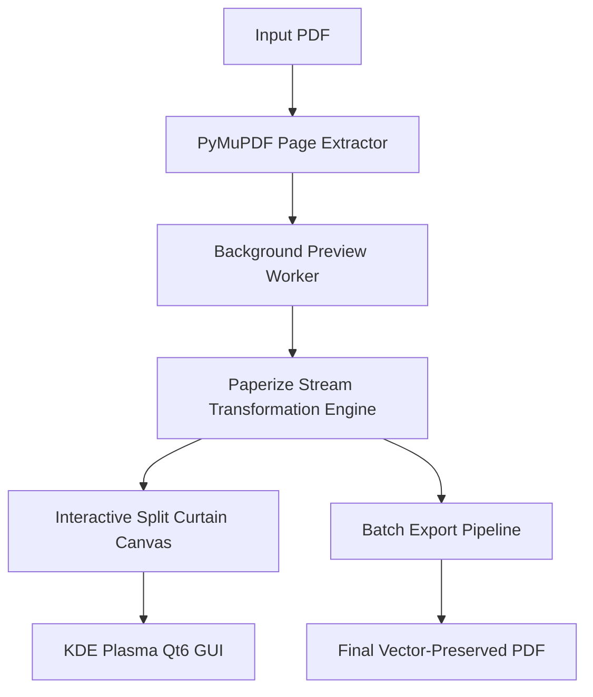

# Paperize GUI 📜✨

> **Turn glaring white PDF pages into warm, comfortable paper — with live split-screen preview and vector preservation.**

A native Linux desktop application built with **PySide6 (Qt6)**, **PyMuPDF**, and **pikepdf** that non-destructively styles PDF document streams.


---

## Key Highlights

- ⚡ **Non-Destructive Vector Transformation**: Built on [Paperize](https://github.com/humanitas-labs/paperize). Modifies PDF streams directly rather than rasterizing pages into images. Selectable text, searchable content, bookmarks, and links remain intact.
- 🎚️ **Interactive Split-Screen Curtain**: Compare original stark white pages against warm paper tones with a draggable divider handle.
- 🎨 **Aesthetic Reading Presets**:
  - **Parchment**: Soft golden-warm antique paper with subtle radial falloff.
  - **Cream**: Gentle off-white/ivory ideal for prolonged night reading.
  - **Sepia**: Classic library vintage aesthetic.
- 🛠️ **Real-Time Fine-Tuning**: Sliders for Warmth/Strength, Paper Texture grain, and Vignette falloff.
- ⚡ **Zero-Freeze Multithreading**: Background rendering workers (`QThread`) ensure the UI stays responsive even when rendering high-DPI document previews.
- 📂 **Batch Processing**: Queue entire directories of books, whitepapers, or planners and convert them with one click.
- 🐧 **Native KDE Plasma & Linux Integration**: Automatically follows system color palettes (Breeze Light / Dark) and runs natively on Wayland and X11.

---

## Architecture & Technology Stack



- **Frontend**: PySide6 (Qt 6.11+)
- **Rendering & Preview**: PyMuPDF (`fitz`)
- **PDF Manipulation Engine**: `pikepdf` + `paperize-pdf`
- **Target OS**: Linux (CachyOS / Arch Linux / KDE Plasma / Wayland)

---

## Installation & Setup

### 1. Arch Linux / CachyOS (via AUR / PKGBUILD)

```bash
git clone https://github.com/kai/paperize-gui.git
cd paperize-gui
makepkg -si
```

### 2. Manual / Developer Installation

```bash
# Clone the repository
git clone https://github.com/kai/paperize-gui.git
cd paperize-gui

# Create a virtual environment
python3 -m venv .venv
source .venv/bin/activate

# Install dependencies and package
pip install -e .

# Run the app
paperize-gui
```

---

## Usage

```bash
# Launch GUI directly
paperize-gui

# Open a specific PDF immediately on launch
paperize-gui path/to/document.pdf
```

### Keyboard Shortcuts
- `Ctrl + O`: Open PDF
- `Ctrl + S`: Export current document
- `Ctrl + +` / `Ctrl + -`: Zoom in / Zoom out
- `PageUp` / `PageDown`: Previous / Next page
- `Ctrl + Wheel`: Zoom canvas

---

## License

MIT License. Core PDF stream algorithm courtesy of [Humanitas Labs / Paperize](https://github.com/humanitas-labs/paperize).
